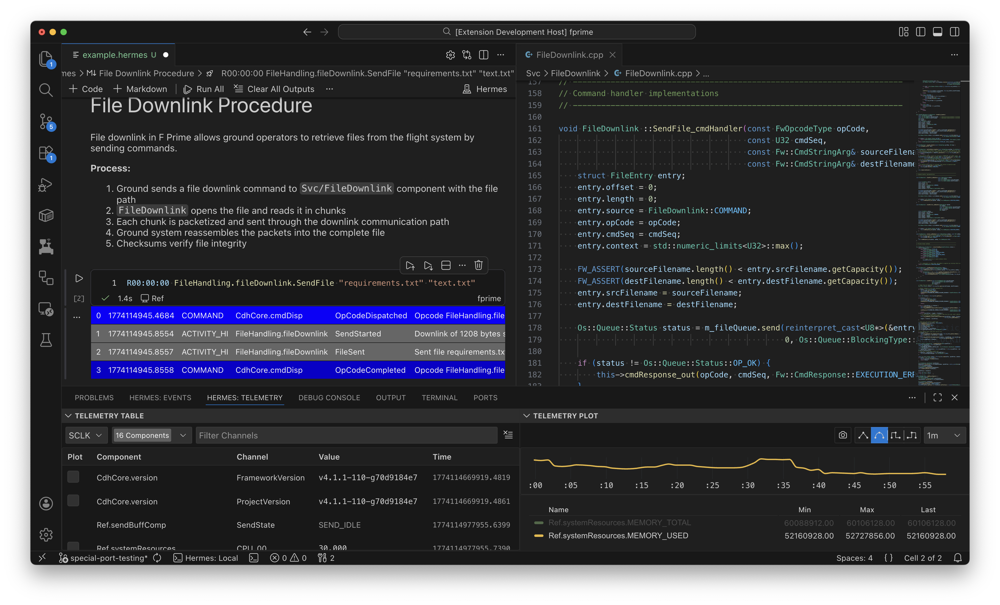

<h2 align="center">Hermes, A Lightweight Telemetry and Commanding Framework</h2>

 

#
Hermes is a plugin driven spacecraft telemetry processing and commanding
framework built around a variety of mature open-source software.

> [!IMPORTANT]  
> Hermes is currently undergoing migration from our internal deployment
> to public Github. Documentation is in the works.

## Hermes Capabilities

- Command completion, validation, & dispatch inside a [Visual Studio Code](https://code.visualstudio.com/) interface.
- Telemetry database interaction with a variety of [databases](#databases).
- An extensible and pluggable telemetry processing framework for interacting with flight software downlink
- Out of the box support for [F Prime](https://github.com/nasa/fprime)
- Integration with [Grafana](https://grafana.com)
