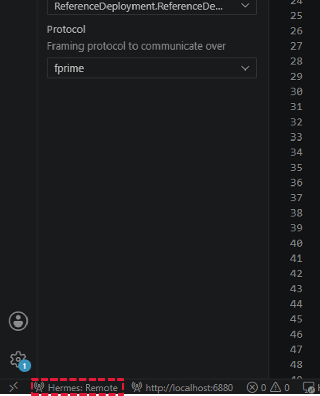
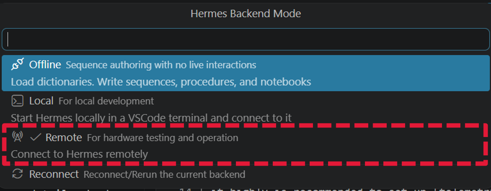
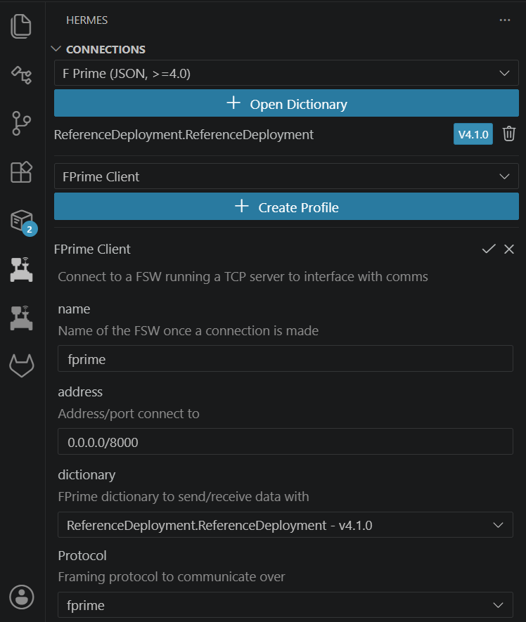

# Execution

Add a flow diagram of the process expected for the procedure usage

---
## Quickstart Execution
If any of these steps seems confusing and needs more detail, check out the sections further on

  

    <h3>Remote Host Connection</h3>
    <ul>
        <li>Click the button at the bottom left corner of VS Code for Hermes</li>
        <li>Switch from Hermes:Offline to Hermes: Remote</li>
        <li>Select the remote host to connect to (should default to the correct location)</li>
        <li>Click the left panel icon for Hermes</li>
        <li>Create a profile if one doesn't exist yet</li>
        <li>Update/verify the Connection Name, IP Address, and Websocket</li>
        <li>Click the Play button to connect</li>
        <li>Open the procedure of choice and start commanding!</li>
    </ul>
  

  

    <h3></h3>
    

        
    

    

        
    

  

---

## Create/Update a Profile

* Assumption: FPrime Backend is running

    * If a local FPrime needs to be started, follow the Quick Start instructions

  

    <h3>Remote Host Connection</h3>
<table style="width: 100%; border-collapse: collapse;">
  <tbody>
    <tr>
      <td style="border: 1px solid #ccc; padding: 8px;"><b>Dropdown</b></td>
      <td style="border: 1px solid #ccc; padding: 8px;">FPrime Client</td>
    </tr>
    <tr>
      <td style="border: 1px solid #ccc; padding: 8px;"><b>Name</b></td>
      <td style="border: 1px solid #ccc; padding: 8px;"><code>fprime</code></td>
    </tr>
    <tr>
      <td style="border: 1px solid #ccc; padding: 8px;"><b>Address</b></td>
      <td style="border: 1px solid #ccc; padding: 8px;"><code>0.0.0.0/8000</code></td>
    </tr>
    <tr>
      <td style="border: 1px solid #ccc; padding: 8px;"><b>Dictionary</b></td>
      <td style="border: 1px solid #ccc; padding: 8px;">Based on FPrime Install</td>
    </tr>
    <tr>
      <td style="border: 1px solid #ccc; padding: 8px;"><b>Protocol</b></td>
      <td style="border: 1px solid #ccc; padding: 8px;"><code>ccsds</code></td>
    </tr>
  </tbody>
</table>

  

  

    <h3></h3>
    

        
    

  

---

!!! question "FAQs"

!!! warning "Documentation In Progress"

    This documentation is incomplete while we are migrating from our internal documentation store to the public GitHub.

   

  

