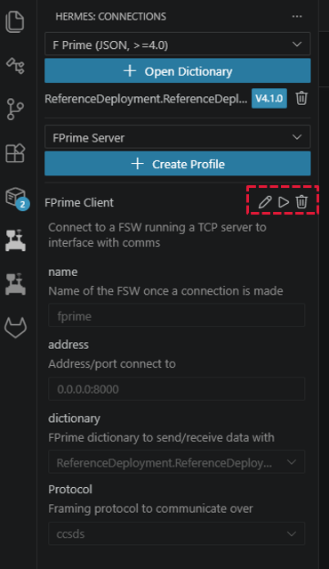
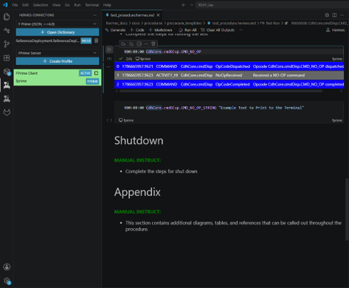

# Execution

Add a flow diagram of the process expected for the procedure usage

---
## Dry-Run Execution - FPrime on Windows (WSL)
If any of these steps seems confusing and needs more detail, check out the sections further on
### Start Hermes in a Powershell Terminal

* Open a Windoes File Explorer and navigate to this location
  
  * C:\Users\<your_user_name>\.vscode\extensions\jet-propulsion-laboratory.hermes-X.X.X-win32-x64\out\backend.exe

  * The version X.X.X of FPrime needs to be updated to what was downloaded during the Quickstart installation phase
  
  * The "your_user_name" needs to be updated

* rename the file "backend" to "backend.exe"

* In VS Code, open a Powershell terminal and send

  * C:\Users\<your_user_name>\.vscode\extensions\jet-propulsion-laboratory.hermes-X.X.X-win32-x64\out\backend.exe

* Hermes backend is now running!

### Connect VS Code to Hermes 

  

    <h3>Remote Host Connection</h3>
    <ul>
        <li>Click the button at the bottom left corner of VS Code for Hermes</li>
        <li>Switch from Hermes:Offline to Hermes: Remote</li>
        <li>Select the remote host to connect to (should default to the correct location)</li>
        <li>Click the left panel icon for Hermes (rover icon)</li>
        <li>Create a profile if one doesn't exist yet</li>
        <li>Update/verify the Connection Name, IP Address, and Websocket</li>
        <li>Click the Play button to connect</li>
        <li>Open the procedure of choice and start commanding!</li>
    </ul>
  

  

    <h3></h3>
    

        
    

    

        
    

  

---

## Create/Update a Profile

  

    <h3>Remote Host Connection</h3>
<table style="width: 100%; border-collapse: collapse;">
  <tbody>
    <tr>
      <td style="border: 1px solid #ccc; padding: 8px;"><b>Dropdown</b></td>
      <td style="border: 1px solid #ccc; padding: 8px;">FPrime Client</td>
    </tr>
    <tr>
      <td style="border: 1px solid #ccc; padding: 8px;"><b>Name</b></td>
      <td style="border: 1px solid #ccc; padding: 8px;"><code>fprime</code></td>
    </tr>
    <tr>
      <td style="border: 1px solid #ccc; padding: 8px;"><b>Address</b></td>
      <td style="border: 1px solid #ccc; padding: 8px;"><code>0.0.0.0:8000</code></td>
    </tr>
    <tr>
      <td style="border: 1px solid #ccc; padding: 8px;"><b>Dictionary</b></td>
      <td style="border: 1px solid #ccc; padding: 8px;">Based on FPrime Install</td>
    </tr>
    <tr>
      <td style="border: 1px solid #ccc; padding: 8px;"><b>Protocol</b></td>
      <td style="border: 1px solid #ccc; padding: 8px;"><code>ccsds</code></td>
    </tr>
  </tbody>
</table>

  

  

    <h3></h3>
    

        
    

  

---
## Connect Hermes and FPrime

  

    <h3></h3>
    <ul>
        <li>Click the check button</li>
        <li>Click the Play button</li>
        <li>Switch to a .hermes.md and start sending your commands!</li>
    </ul>
  

  

    <h3></h3>
    

        
    

  

  

    <h3></h3>
    <ul>
        <li>The indicator of successfully sent commands will show a green check in the code block and return EVRs/EHAs in the output under the code block.</li>
    </ul>
  

  

    <h3></h3>
    

        
    

  

---

!!! question "FAQs"

!!! warning "Documentation In Progress"

    This documentation is incomplete while we are migrating from our internal documentation store to the public GitHub.

   

  

