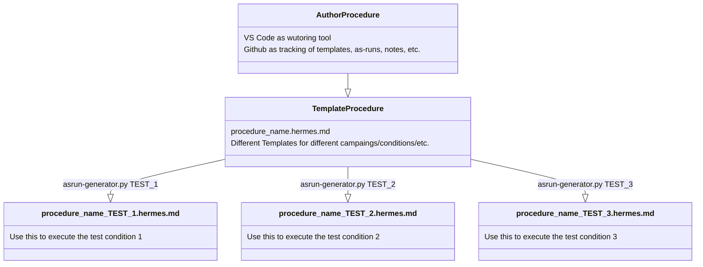

# Procedures

Documentation of a test is crucial to repeatable data collection. Procedures are used to record the steps taken for each test performed. Procedures can have different use cases, formats, and requirements.

An architechture that has proven successful and effetive has been included as a recommended method of authoring, executing, and tracking procedures.

Terms

* Template: A standard document that can be used multiple times
* As-Run: The procedure used to record a specific test instance.
* Test-ID: The unique identification of a test or a condition  

## Directory Structure

* user_folder
    * procedures
        * as_runs
            * campaign_1
                * procedure_pictures
                    * image1.jpeg
                    * image2.jpeg
                * test_procedure_TEST_1.hermes.md
                * test_procedure_TEST_2.hermes.md
                * test_procedure_TEST_3.hermes.md

        * procedure_templates
            * procedure_pictures
                * image1.jpeg
                * image2.jpeg
            * asrun_generator.py
            * test_procedure.hermes.md

## Procedure Generation Flow

!!! question "FAQs"