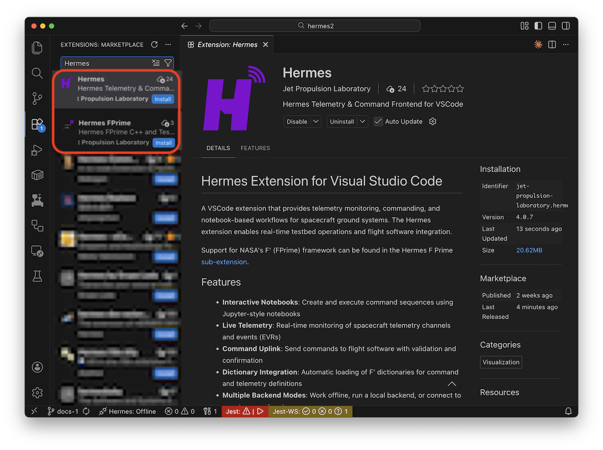

# Installation

Hermes can be installed in multiple ways depending on your use case. For most users, the VSCode extension from the marketplace is the recommended approach as it includes everything needed to get started.

Typically the method will
depend on the context you are running in. Flight software developers and
small teams should use the [VSCode marketplace](#vscode-marketplace-recommended) while production environments and mission
operations will use a [standalone binary](#standalone-backend-binary)

## VSCode Marketplace (Recommended)

The easiest way to install Hermes is through the [Visual Studio Code](https://code.visualstudio.com/) [marketplace](https://marketplace.visualstudio.com/items?itemName=jet-propulsion-laboratory.hermes)



1. [Install](https://code.visualstudio.com/) & Open Visual Studio Code
2. Go to the Extensions view (`Cmd+Shift+X` on macOS, `Ctrl+Shift+X` on Windows/Linux)
3. Search for "Hermes"
4. Install the **Hermes** extension (ID: `jet-propulsion-laboratory.hermes`)
5. Optionally, install the **Hermes FPrime** [extension](https://marketplace.visualstudio.com/items?itemName=jet-propulsion-laboratory.hermes-fprime) for F' framework support.

**What's included:**

- Complete VSCode integration with telemetry viewers, command interfaces, and sequence editors
- Backend binary bundled for your platform (automatically selected)
- Local backend mode enabled by default - no additional setup required

**Supported platforms:**

- macOS (Intel, Apple Silicon)
- Linux (x64, ARM64)
- Windows (x64, ARM64)

!!! info "Windows Support"

    Windows build is supported however we do not run regression tests for the
    backend services on Windows. It is recommended to run the Hermes backend
    on a Linux or macOS host for the best support.

## Standalone Backend Binary

For running Hermes backend as a standalone service (testbed environments, CI/CD, mission operations):

1. Go to the [Hermes releases page](https://github.com/nasa/hermes/releases)
2. Download the backend binary for your platform `hermes-<version>-<platform>.tar.gz`:
3. Untar the backend:
   ```bash
   tar -xvf hermes-<version>-<platform>.tar.gz
   ```
4. Run the backend:
   ```bash
   ./backend --bind-type tcp --bind :6880
   ```

See more detailed setup and configuration instructions on
backend configuration and setup for production environment [here](../prod/index.md)

**When to use standalone backend:**

- Running backend on a dedicated server or testbed computer
- Connecting multiple VSCode instances to a shared backend
- Integrating Hermes into existing ground system infrastructure
- CI/CD environments for automated testing

**Connecting VSCode to remote backend:**

1. Install the VSCode extension
2. Change from "local" to "remote"
3. Set "hermes.host.url" to your backend URL (e.g., `http://0.0.0.0:6880`)

## GitHub Releases (for automation or offline environments)

If you need a specific version or want to install manually:

1. Go to the [Hermes releases page](https://github.com/nasa/hermes/releases)
2. Download the `.vsix` file for your platform:
3. Optionally download `hermes-fprime-<version>.vsix` for F' support
4. Install the extension(s):
   ```bash
   code --install-extension hermes-core-<version>-<platform>.vsix
   code --install-extension hermes-fprime-<version>.vsix
   ```

**Note:** Each platform-specific `.vsix` file includes the backend binary compiled for that platform. Make sure to download the correct version for your system.

## Build from Source (for developers)

For development or customization:

**Prerequisites:**

- Go 1.25 or later
- Node.js 20 or later
- Yarn package manager

**Build steps:**

```bash
# Clone the repository
git clone https://github.com/nasa/hermes.git
cd hermes

# Install the NodeJS dependencies
yarn install

# Build everything
make all

# Or build components separately
make go              # Build all Go binaries
yarn build           # Build VSCode extensions
```

**Outputs:**

- Go binaries: `out/backend`, `out/uplink`, `out/sqlrecord`, etc.
- NodeJS scripts: `out/*.js`
- VSCode bundled sources: `src/extensions/out/*.js`

## Next Steps

- [Getting Started Guide](./quick-start.md) - Create your first profile and connect to flight software
- [Core Concepts](../arch/core-concepts.md) - Learn about Hermes Core Concepts and Design Patterns
- [Telemetry Monitoring](../tlm/index.md) - Setup your monitoring infrastructure
