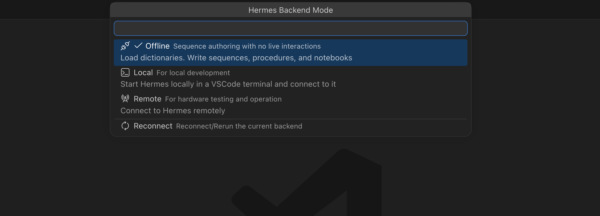
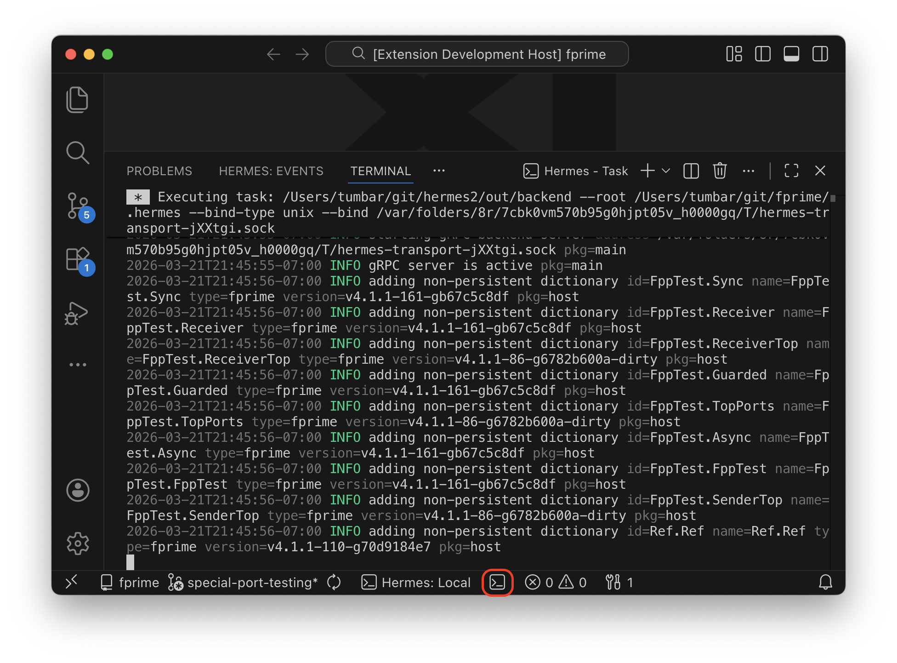
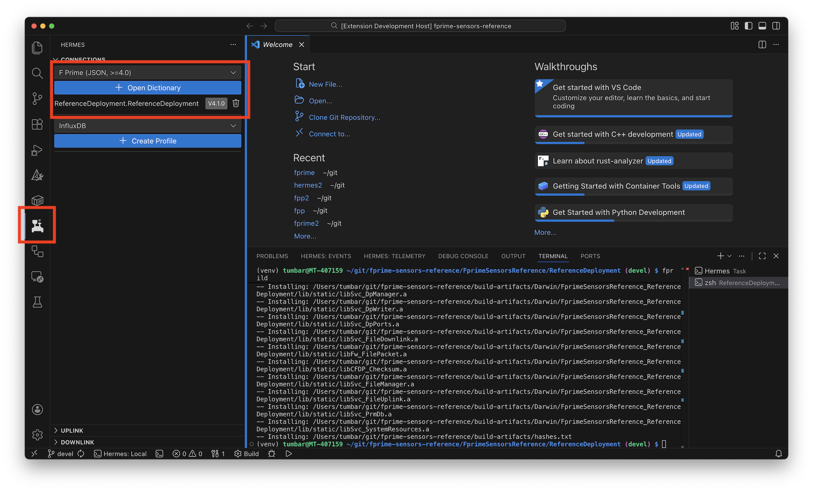
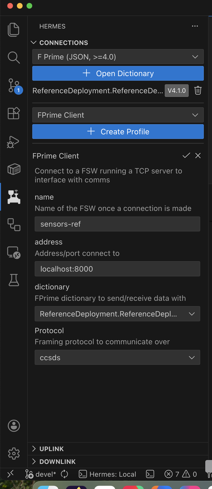
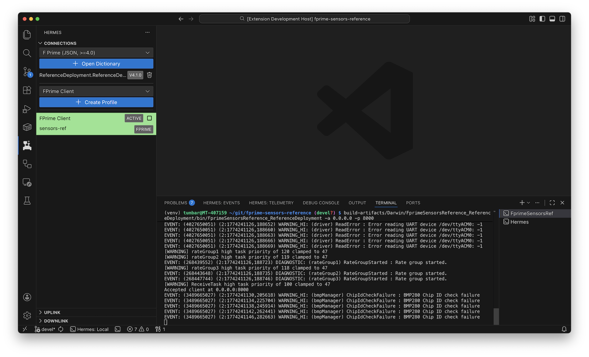
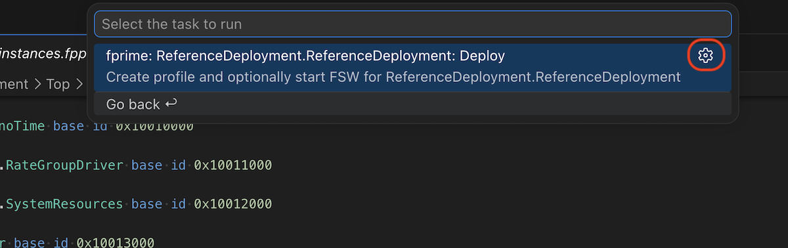

# Quick Start

!!! abstract

    This quick start guide is tailored for the [F Prime](https://fprime.jpl.nasa.gov)
    software framework though much of this guide can be applied to other software frameworks.

**Prerequisites**

1. [Visual Studio Code](https://code.visualstudio.com/)
2. [Hermes VSCode Extension](https://marketplace.visualstudio.com/items?itemName=jet-propulsion-laboratory.hermes)
3. [Hermes F Prime VSCode Extension](https://marketplace.visualstudio.com/items?itemName=jet-propulsion-laboratory.hermes-fprime)
4. A basic understanding of writing and running [F Prime](https://github.com/nasa/fprime) Flight Software

## Overview

This guide will walk you through:

1. Starting the Hermes backend in local mode
2. Building and running your F Prime deployment
3. Creating a profile and connecting to your flight software (FSW)
4. Verifying the connection

By the end of this guide, you'll have Hermes connected to your F Prime deployment and ready to send commands and receive telemetry.

## Starting the Hermes Backend

The Hermes VSCode extension starts in **offline mode** by default. This
means that there is _no_ backend to connect to the flight software with.
To connect to the FSW you'll need to connect the VSCode frontend to a
backend. The simplest way to do this is by starting the backend bundled
with the Hermes VSCode extension in **local mode**.

The connection of the VSCode frontend to the backend can be managed by
the status bar item at the bottom of the VSCode window.



You'll be presented with some options about how to connect to a Hermes
backend. In this guide we will be using **Local Mode**. The **Remote Mode**
will become useful once you are ready to deploy Hermes into a
[production environment](../prod/index.md) though is not strictly required.

**Verifying the Backend**

To validate the backend started correctly, the VSCode terminal process
running the backend can be focused to show the logs associated with the
backend.



## Building Your F Prime Deployment

Before connecting to your flight software, you need to build your F Prime deployment and generate its dictionary. It is recommended to read the F Prime
[Hello World Tutorial](https://fprime.jpl.nasa.gov/latest/tutorials-hello-world/docs/hello-world/)
to learn how to develop and iterate on flight software. In the next section we
will show a quick set of instructions to get started using [fprime-sensors-reference](https://github.com/fprime-community/fprime-sensors-reference) as a guide.

### Set up the development environment

First you'll need to clone and perform first time Python Virtual Environment setup
in the repository.

```bash title="Workspace setup"
git clone --recursive git@github.com:fprime-community/fprime-sensors-reference.git
cd fprime-sensors-reference
python3 -m venv fprime-venv
source fprime-venv/bin/activate
pip install -r lib/fprime/requirements.txt
```

### Building Flight Software

Now you can build the F Prime deployment.

```bash title="Building Sensors Ref Deployment"
cd FprimeSensorsReference/ReferenceDeployment
fprime-util generate
fprime-util build
```

If the deployment successfully built, Hermes should automatically detect the
dictionary in the top of the rover panel.



## Running Your F Prime Deployment

To run the deployment, there are couple of factors to consider:

**Communications Framing Protocol**

There are two options here:

- `ccsds`: The industry standard framing
    - Uplink follows [TC Frame](https://ccsds.org/Pubs/232x0b4e1c1.pdf)
    - Downlink follows [TM Frame](https://ccsds.org/Pubs/132x0b3.pdf)
- `fprime`: A lightweight custom framing protocol for non-flight use.

!!! note
    As of F Prime version 4.1, the default framing protocol is `ccsds`.

**Transport Method**

The transportation method determines the physical link between the flight software
and the ground. This might be through a radio via UART, TCP socket, UDP socket.
The F Prime Hermes backend plugin only supports hosting a TCP server at a specified
address _or_ connecting to a TCP server at a specified address. Typically this is
_not_ enough to run a proper spacecraft so you'll need to use a [relay](../prod/advanced/relay.md).

!!! tip
    When running F Prime flight software locally, a TCP server or client is
    usually sufficient. You can look for the `comDriver` component in your
    topology to determine which type to use on the ground.

In our example deployment, the topology's `comDriver` is `TcpServer`. This
means that the ground must connect via a TCP client to the FSW server.

### Option 1: Hermes Profile

{ width=200 align=right }

The primary way to connect FSW to Hermes is by create a _profile_. A profile
is the primary entrypoint of a Hermes backend plugin. It defines a service
to run in order to connect to some external software or hardware.

In our case, we will be using one of the F Prime profiles, there are two:

- **FPrime Server**: Hermes will host a TCP server at a specified address/port and await a TCP connection. It will then communicate over the specified framing protocol with the client connection.
- **FPrime Client**: Hermes will create a TCP client and attempt to connect at the specified address. Once connected it will communicate with the server over the specified framing protocol.

Because `fprime-sensors-reference` uses a TcpServer for its `comDriver` component,
we need to use the complimentary `FPrime Client` profile in Hermes.

You'll need to fill in the dictionary and protocol fields to match your deployments
specifications and click the :fontawesome-solid-check: check mark.

#### Starting the profile

When starting the Hermes profile via the :fontawesome-solid-play: Play button,
Hermes will attempt to connect to the TCP server at the specified address (`localhost:8000`).
We'll first need to boot up our flight-software so that the TCP server is active.

```bash
build-artifacts/Darwin/FprimeSensorsReference_ReferenceDeployment/bin/FprimeSensorsReference_ReferenceDeployment -a 0.0.0.0 -p 8000
```

Now clicking the :fontawesome-solid-play: Play button should cause the profile
to turn green:



!!! success
    You have now connected Hermes with F Prime flight software!

### Option 2: VSCode Task

Another way to launch an F Prime deployment is by using the VSCode task provided
by the Hermes F Prime VSCode extension. This method is ideal though requires
more upfront configuration.

The VSCode task will:

1. Launch the flight-software
2. Create a temporary Hermes profile with the proper fields
3. Start the profile
4. Handle flight software exists and clean up

To create the VSCode task:

1. Open the command pallete ++ctrl+shift+p++ (++command+shift+p++ on macOS)
2. Search for `Tasks: Run Task`
3. Select `hermes-fprime-deployment`
4. There should be a single task (or one for every deployment in your workspace). Click the gear icon



This should open up the JSON file for configuring VSCode tasks. By clicking the
gear icon, you add this F Prime deployment as a VSCode configured task which
allows you to change any settings that need changing.

```json title=".vscode/tasks.json" linenums="1" hl_lines="4 5"
{
    "type": "hermes-fprime-deployment",
    "title": "FprimeSensorsReference_ReferenceDeployment",
--- "profileProvider": "FPrime Server",
+++ "profileProvider": "FPrime Client", // (1)!
    "profileSettings": {
        "name": "ReferenceDeployment.ReferenceDeployment",
        "address": "0.0.0.0:8000",
        "dictionary": "ReferenceDeployment.ReferenceDeployment",
        "protocol": "ccsds"
    },
    "fswCommand": "build-artifacts/Darwin/FprimeSensorsReference_ReferenceDeployment/bin/FprimeSensorsReference_ReferenceDeployment -a 0.0.0.0 -p 8000",
    "group": "build",
    "problemMatcher": [],
    "label": "fprime: ReferenceDeployment.ReferenceDeployment: Deploy",
    "detail": "Create profile and optionally start FSW for ReferenceDeployment.ReferenceDeployment"
}
```

1.  Replace the default `FPrime Server` with `FPrime Client` to tell Hermes to
    connect to a TCP server rather than host one.

As previously mentioned, this deployment will run the TCP server in the FSW process
and expect the ground to connect to it to receive and transmit data. We will need
to change the `profileProvider` option in this configuration to `FPrime Client` to
tell Hermes to connect to (rather than serve) a TCP server.

You may need to change some other options in this task. Most notably the
`fswCommand` which by default attempts to run the flight software build artifact.
This isn't always a good assumption. This command is simply a shell command which
should start the flight software in some way.

#### Starting the task

Using the VSCode command pallete again:

1. ++ctrl+shift+p++ (++command+shift+p++ on macOS)
2. `Tasks: Run Task`
3. You should now see the new task we configured from the `tasks.json` file

Running this task will launch a terminal that will configure a Hermes profile,
launch FSW and connect the two together. You should notice a green active profile
box similar to that in "Option 1".
