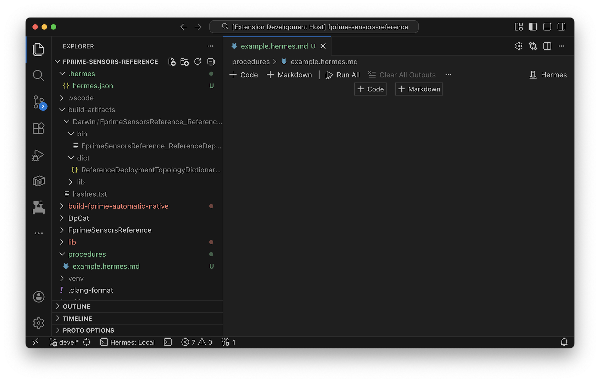
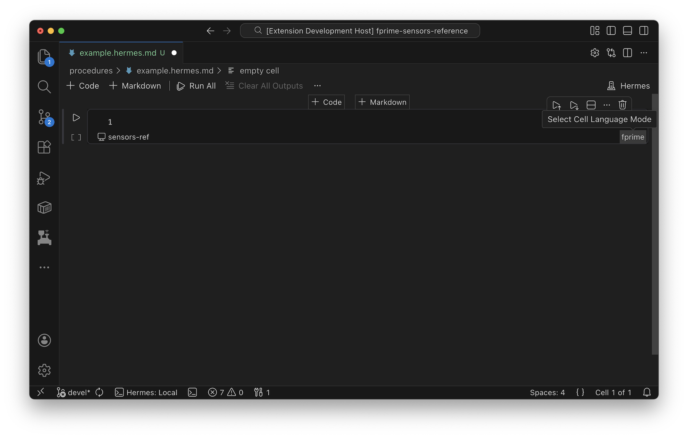
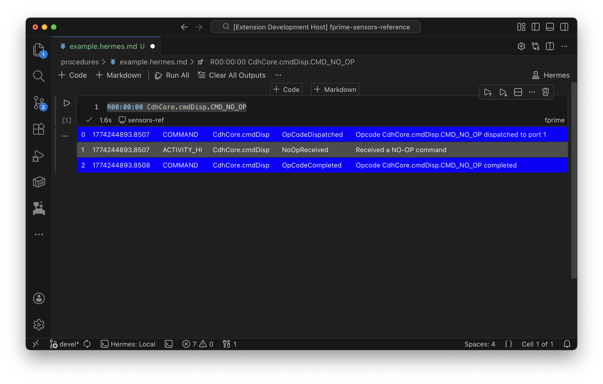
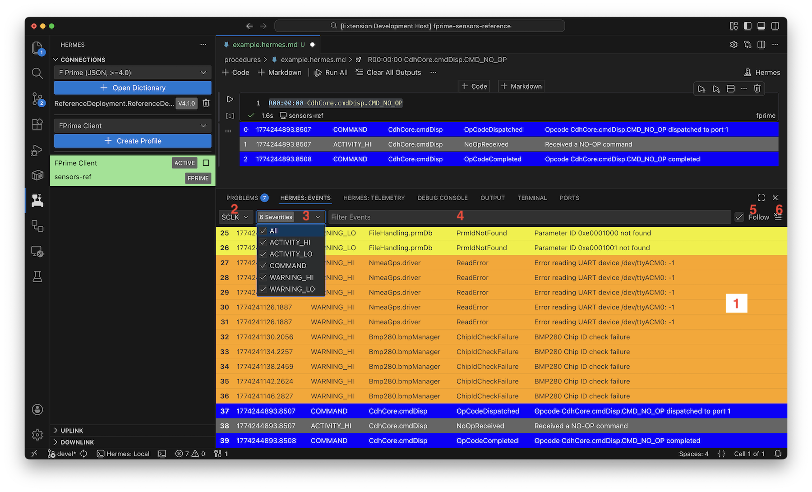
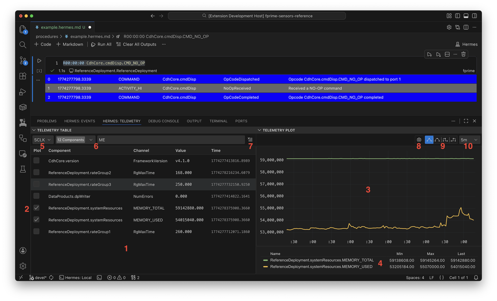

# Workflow

This document will describe the various features of the Hermes frontend
to help define a user's workflow when interacting with their system.
If you have not yet connected Hermes to your flight-software you should
follow [this](./quick-start.md) guide first.

This document only describes features in VSCode. This may be suffcient for
software or local development. However during test activities and flight operations,
it highly is recommended to set up [telemetry monitoring](../tlm/index.md)
infrastructure to persist data and monitor channels.

## Commanding & Notebooks

Hermes utilizes VSCode Notebooks which are very similar to
[Jupyter Notebooks](https://code.visualstudio.com/docs/datascience/jupyter-notebooks)
though true Jupyter Notebooks are not actually used by Hermes.

Hermes uses [Markdown](https://www.markdownguide.org/basic-syntax/)
as a backing format to define notebooks. A hermes notebook may be created
using the `.hermes.md` extension.

Once you create a `.hermes.md` file you should see something like this:



Notebooks in VSCode are divided up into _cells_. There are two types of cells:
code and markdown. A markdown cell is a documentation cell that supports
[VSCode Markdown](https://code.visualstudio.com/docs/languages/markdown). These
cells are typically used to denote human instructions or additional contextual
information around raw FSW commands. A code cell is a cell that can be "executed"
or dispatched or a given FSW connection. Code cells have an associated language
and certain connections support dispatching certain languages.

### Basic Command Dispatch

Let's start by creating a code cell and changing the language type to `fprime`.



Once changed we should see that the bottom left of the code cell shows the name
of the FSW connection this code cell will dispatch commands to. In the
[previous](./quick-start.md#option-1-hermes-profile) tutorial we named our FSW connection `sensors-ref`
which now shows up in our notebook.

Now you may type a FSW command and dispatch it. In our example we are using a
connection to F Prime. F Prime commands come in the form:

```bash
# Relative-time commanding
R[HH]:[MM]:[SS] component.MNEMONIC [args...]
```

For example a common command to test the connection between ground and flight is:

```bash
R00:00:00 CdhCore.cmdDisp.CMD_NO_OP
```

Clicking the :fontawesome-solid-play: Play button for the cell will dispatch
each command, line by line in the cell until it reaches the first command failure.
The events that are emitting during the execution of the cell will be displayed
as they are received under the code cell:



### Dictionary Selection


## Event Reports

Events that are emitted during the execution of a code block are logged inside
the notebook. However, this is not sufficient as events outside of the execution
time of a code cell may stream to the ground. Also, the notebook may be cleared
and therefore events lost.

Hermes provides a tab in the VSCode [panel](https://code.visualstudio.com/docs/getstarted/userinterface#_basic-layout)
called `Hermes: Events`.



This panel keeps a log of all the events streaming from the FSW. They are kept
in memory and can be searched and filtered in this panel. The features of this panel
enumerated in the image above are described below:

| Feature | Name                     | Description                                                                                                       |
| ------- | ------------------------ | ----------------------------------------------------------------------------------------------------------------- |
| 1       | EVR Table                | Event table showing all in-memory events stored in this frontend with the source/severity/message filter applied. |
| 2       | Time format              | Format to display timestamp in. SCLK displayes the raw spacecraft clock, UTC & Local are derived from ERT.        |
| 3       | Source / Severity filter | Filter events by severity level. If multiple FSW connections are active, another source filter will appear.       |
| 4       | Message filter           | Filter events by message string (right-most column).                                                              |
| 5       | Follow                   | When checked, the table will automatically scroll to show the latest event as new events arrive to the ground.    |
| 6       | Clear Log                | Clear the in-memory store of events to free up memory usage. It is recommeded to use this during long test runs.  |

## Telemetry Charts

Telemetry channels are samples of data streamed to the ground at various rates configured
by the FSW. Channels can be defined as any [type](../arch/core-concepts.md#types) such as
a numeric, struct, array etc. Hermes ships with a tab in the VSCode Panel called `Hermes: Telemetry`
which has two panes:

1. Telemetry Table: A table view showing all the channels that Hermes has received and their latest value
2. Telemetry Plot: A time series plot of the _numeric_ channels selected in the table.



| Feature | Name                     | Description                                                                                                                                     |
| ------- | ------------------------ | ----------------------------------------------------------------------------------------------------------------------------------------------- |
| 1       | Telemetry Table          | Telemetry table showing latest value of each channel stored in this frontend with the source/severity/message filter applied.                   |
| 2       | Plot Select              | When checked (only shows for numeric channels), this channel will be plotted in the telemetry plot.                                             |
| 3       | Telemetry Plot           | Displays all the channels that are selected in the table over the selected time range.                                                          |
| 4       | Telemetry Plot Legend    | Displays the min/max/last values of each channel selected in the plot. Items pay be temporarily hidden from the plot by clicking on the legend. |
| 5       | Time format              | Format to display timestamp in. SCLK displayes the raw spacecraft clock, UTC & Local are derived from ERT.                                      |
| 6       | Source / Severity filter | Filter channels by component or name. If multiple FSW connections are active, another source filter will appear.                                |
| 7       | Clear Data               | Clear the in-memory store of telemetry to free up memory usage. Hermes VSCode has a hard limit per-channel at ~10k samples.                     |
| 8       | Screenshot               | Render the telemetry plot to an image.                                                                                                          |
| 9       | Interpolation Mode       | Determines how to connect lines between samples (i.e. linear, smooth last, current).                                                            |
| 10      | Time Window              | Time window to display data over. Relative to current time.                                                                                     |

!!! note
    The telemetry plot includes a backing in-memory database to store telemetry samples. To save from unbounded memory growth,
    each channel is limited to 10k samples. Older samples are cleared after this limit is reached.

!!! tip
    This telemetry plot is not meant to be a comprehensive dashboarding solution. It is recommeded to connect
    Hermes to [Grafana](https://grafana.com) for a more complete experience.

## File Uplink & Downlink


