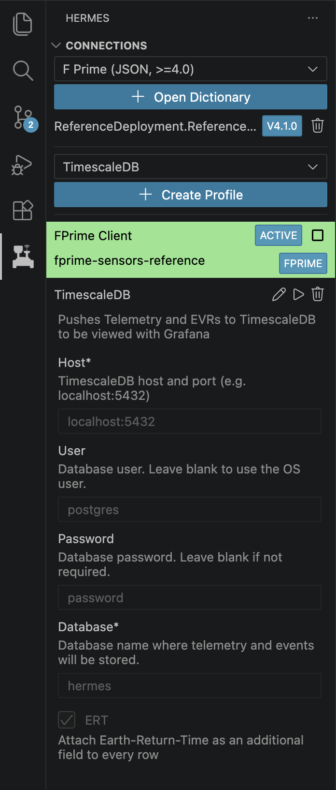

# TimescaleDB

{ width=200 align=right }

Hermes offers an docker compose containing an TimescaleDB and Grafana instance, found in `timescale-stack`. To get started with development, start the database locally with `docker compose --project-directory ./timescale-stack up -d`. Next, we can connect the backend to the database with the Hermes VS Code extension. Create a new TimescaleDB Profile and fill out the information. The default values can be found in the accompanying screenshot. Once you have both the flight software connection and the TimescaleDB connection, you should be able to see telemetry and events flowing into the database and should be visible in Grafana at `localhost:3000`.

!!! warning "Documentation In Progress"

    This documentation is incomplete while we are migrating from our internal documentation store to the public GitHub.
